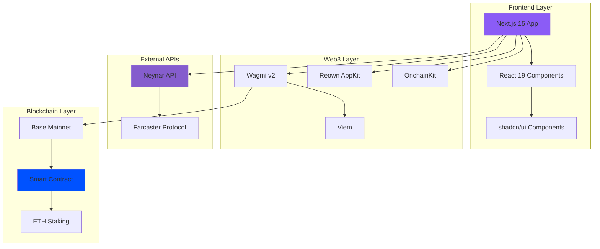
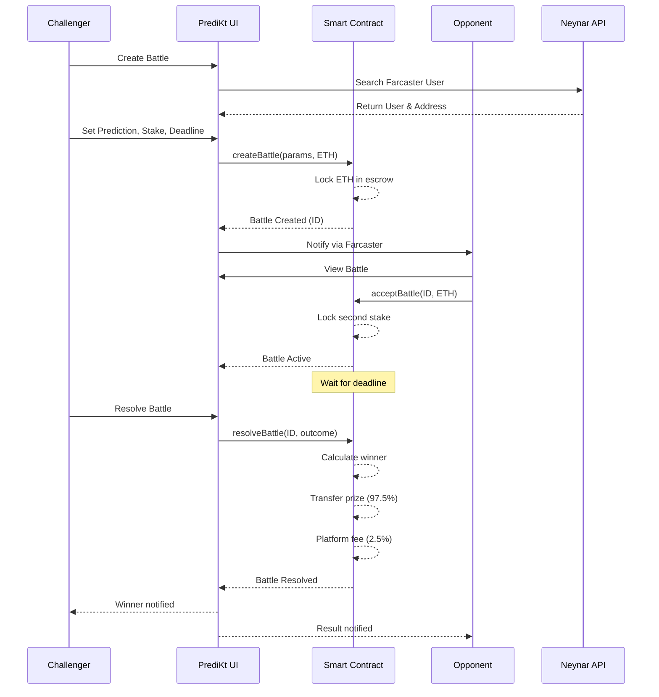
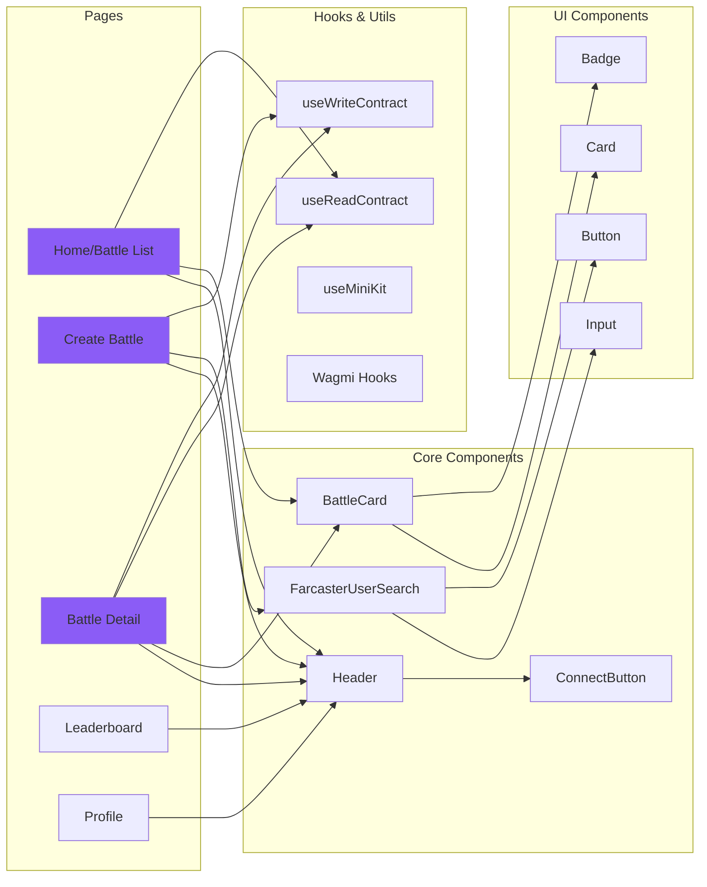
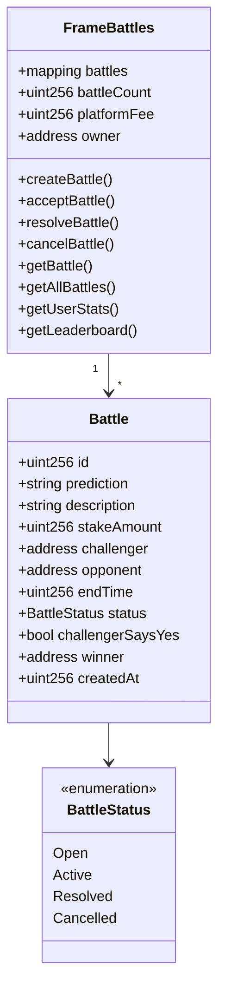

# PrediKt

> **Challenge. Predict. Win.**

PrediKt is a decentralized prediction battles platform built on Base, integrated with Farcaster. Challenge your friends to 1v1 prediction duels, stake ETH on the outcome, and prove who's right!


## Overview

PrediKt transforms predictions into thrilling head-to-head battles where users can:
- **Create Predictions**: Make bold claims about future events
- **Challenge Friends**: Search Farcaster usernames or open challenges to anyone
- **Stake ETH**: Put your money where your mouth is on Base network
- **Battle It Out**: One says YES, one says NO - winner takes all
- **Prove You're Right**: Resolve battles when the deadline hits

## Key Features

### Prediction Battles
- **1v1 Format**: Direct challenges between two users
- **Smart Contract Escrow**: ETH stakes secured on-chain
- **Flexible Timeframes**: Set battle deadlines from hours to weeks
- **Winner Takes All**: 97.5% of prize pool goes to winner (2.5% platform fee)

### Modern UX
- **Step-by-Step Battle Creation**: Intuitive 3-step wizard
- **Farcaster Integration**: Search users by username, select from followers
- **Real-time Updates**: Live battle status and statistics
- **Responsive Design**: Seamless experience on mobile and desktop
- **MiniKit Compatible**: Full support for Farcaster MiniKit

### Social Features
- **Username Search**: Find Farcaster users easily
- **Follower Selection**: Quick challenge your following
- **Leaderboard**: Track top predictors
- **Profile Stats**: View win rates and earnings

## Architecture

### High-Level System Architecture



### Battle Flow Architecture



### Component Architecture



### Smart Contract Architecture



## Tech Stack

### Frontend
- **Framework**: Next.js 15 with App Router
- **Language**: TypeScript
- **UI Library**: React 19
- **Styling**: Tailwind CSS
- **Components**: shadcn/ui (Radix UI primitives)
- **Icons**: Lucide React
- **Notifications**: Sonner

### Web3 Integration
- **Wallet Connection**: Reown AppKit (formerly WalletConnect)
- **Blockchain Interaction**: Wagmi v2 + Viem
- **Network**: Base Mainnet (Chain ID: 8453)
- **Farcaster Integration**: OnchainKit MiniKit
- **Social Data**: Neynar API

### Smart Contract
- **Language**: Solidity
- **Network**: Base (Ethereum L2)
- **Features**: 
  - ETH staking and escrow
  - Battle lifecycle management
  - User statistics tracking
  - Platform fee collection

## Installation

### Prerequisites
- Node.js 18+ and npm
- Git

### Setup

1. **Clone the repository**
```bash
git clone <repository-url>
cd prediction-market-mini-app
```

2. **Install dependencies**
```bash
npm install
```

3. **Configure environment variables**

Create a `.env.local` file in the root directory:

```bash
# Reown (WalletConnect) Project ID
# Get from: https://cloud.reown.com
NEXT_PUBLIC_REOWN_PROJECT_ID=your_project_id

# OnchainKit API Key
# Get from: https://portal.cdp.coinbase.com/
NEXT_PUBLIC_ONCHAINKIT_API_KEY=your_api_key

# Neynar API Key for Farcaster data
# Get from: https://neynar.com
NEXT_PUBLIC_NEYNAR_API_KEY=your_neynar_key

# App Configuration
NEXT_PUBLIC_PROJECT_NAME="PrediKt"
NEXT_PUBLIC_URL=http://localhost:3000
```

4. **Run the development server**
```bash
npm run dev
```

5. **Open in browser**
```
http://localhost:3000
```

## Deployment

### Vercel (Recommended)

1. **Push to GitHub**
```bash
git push origin main
```

2. **Import to Vercel**
- Go to [vercel.com](https://vercel.com)
- Import your repository
- Add environment variables
- Deploy

3. **Configure environment**
- Add all `.env.local` variables in Vercel dashboard
- Update `NEXT_PUBLIC_URL` to your production domain

### Build locally
```bash
npm run build
npm start
```

## Usage Guide

### Creating a Battle

1. **Connect Wallet**: Click "Connect" in the header
2. **Start Battle**: Click "Start Battle" button
3. **Step 1 - Prediction**:
   - Enter your prediction (e.g., "ETH will hit $5k by Dec 31")
   - Add detailed description and context
   - Choose your stance: YES or NO
4. **Step 2 - Opponent**:
   - Search Farcaster username
   - OR select from your following
   - OR leave blank for open challenge
5. **Step 3 - Stakes**:
   - Set stake amount (ETH)
   - Choose battle deadline
   - Review summary
6. **Confirm**: Sign transaction and create battle

### Accepting a Battle

1. Navigate to battle list
2. Find open battle (yellow "Open" badge)
3. Click to view details
4. Click "Accept Challenge"
5. Confirm transaction with matching stake

### Resolving a Battle

1. After deadline passes
2. Navigate to battle detail
3. Click "Resolve Battle"
4. Select outcome: YES or NO
5. Winner receives 97.5% of total prize pool

## Security Features

- **Smart Contract Escrow**: Stakes locked on-chain
- **Non-custodial**: Users maintain full wallet control
- **Transparent**: All transactions on public blockchain
- **Time-locked**: Battles can't be resolved before deadline
- **Immutable**: Battle terms can't be changed after creation

## Design System

### Color Palette
- **Primary**: Purple (`hsl(262.1, 83.3%, 57.8%)`)
- **Accent**: Blue gradient
- **Success**: Green
- **Destructive**: Red

### Typography
- **Headings**: Inter (Variable font)
- **Body**: Inter
- **Code**: Source Code Pro

### Components
All UI components built with shadcn/ui and fully customizable via Tailwind CSS.

## Smart Contract Details

### Contract Address
```
Base Mainnet: [To be deployed]
```

### Key Functions

#### `createBattle`
```solidity
function createBattle(
    string memory prediction,
    string memory description,
    uint256 endTime,
    bool challengerSaysYes,
    address specificOpponent
) external payable returns (uint256)
```

#### `acceptBattle`
```solidity
function acceptBattle(uint256 battleId) external payable
```

#### `resolveBattle`
```solidity
function resolveBattle(uint256 battleId, bool outcome) external
```

### Events
- `BattleCreated(uint256 battleId, address challenger, uint256 stakeAmount)`
- `BattleAccepted(uint256 battleId, address opponent)`
- `BattleResolved(uint256 battleId, address winner, uint256 prize)`

## Roadmap

### Phase 1: MVP (Current)
- Core battle functionality
- Farcaster integration
- Base network deployment
- Modern UI/UX

### Phase 2: Enhanced Features
- [ ] Automated outcome resolution via oracles
- [ ] Multi-player prediction pools
- [ ] NFT achievements and badges
- [ ] Advanced analytics dashboard
- [ ] Mobile app (React Native)

### Phase 3: DAO & Governance
- [ ] PrediKt token launch
- [ ] Community governance
- [ ] Staking rewards
- [ ] Tournament mode

### Phase 4: Cross-chain
- [ ] Ethereum mainnet
- [ ] Optimism
- [ ] Arbitrum
- [ ] Polygon

## Contributing

Contributions are welcome! Please follow these steps:

1. Fork the repository
2. Create a feature branch (`git checkout -b feature/amazing-feature`)
3. Commit changes (`git commit -m 'Add amazing feature'`)
4. Push to branch (`git push origin feature/amazing-feature`)
5. Open a Pull Request

### Development Guidelines
- Follow existing code style
- Add tests for new features
- Update documentation
- Keep commits atomic and well-described

## License

This project is licensed under the MIT License - see the [LICENSE](LICENSE) file for details.

## Acknowledgments

- **Base**: Fast and affordable L2 blockchain
- **Farcaster**: Decentralized social protocol
- **Reown**: Wallet connection infrastructure
- **Neynar**: Farcaster data API
- **shadcn**: Beautiful UI components
- **Coinbase**: OnchainKit and MiniKit SDK

## Support & Community

- **Twitter**: [@predikt](https://twitter.com/predikt)
- **Farcaster**: @predikt
- **Discord**: [Join our community](https://discord.gg/predikt)
- **Email**: support@predikt.app

## Disclaimer

PrediKt is provided "as is" without warranty of any kind. Users are responsible for:
- Understanding blockchain transaction risks
- Managing their own private keys
- Complying with local gambling/prediction laws
- Conducting due diligence on predictions

**Never stake more than you can afford to lose.**

---

Built by the PrediKt team | Powered by Base & Farcaster

**Challenge. Predict. Win.**
